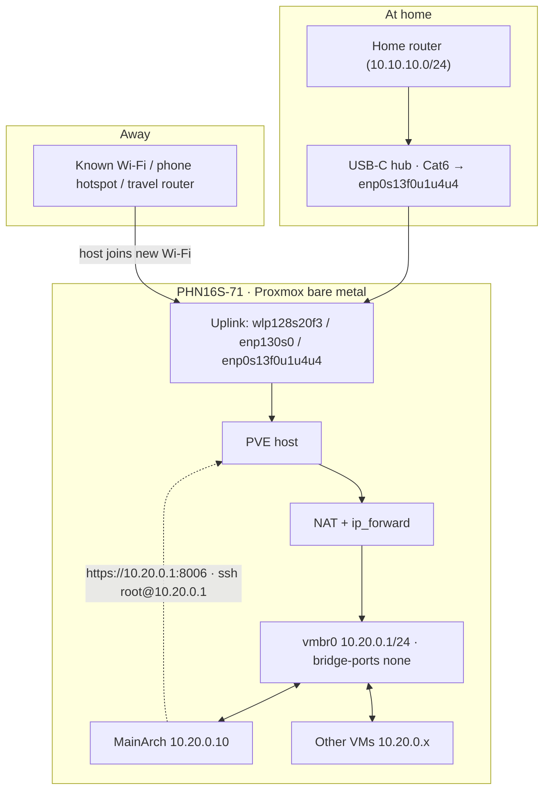

# NETWORKING.md — Portable Headless Networking (PHN16S-71)

Adapted from the portable-headless Proxmox runbook, with this laptop's real
interface names and the ProxDev VM plan.

## 1. Goal
PVE on a laptop, no permanent cable.

- **At home**: USB-C hub Cat6 / internal Killer E3000 → uplink.
- **Away**: preset Wi-Fi (home, phone hotspot, travel router).
- MainArch (the "MainVM") gets Internet via **host NAT** on whatever uplink
  is active; VMs keep talking to the host even with no Internet.
- Fully headless once set up.

**Interface names on PHN16S-71 (confirm with `ip -br link`):**
| Iface | Device | Notes |
|---|---|---|
| `wlp128s20f3` | Intel CNVi Wi-Fi | primary uplink away from home |
| `enp130s0` | Killer E3000 2.5GbE (internal) | wired uplink if a port exists |
| `enp0s13f0u1u4u4` | Realtek RTL8153 (USB-C hub LAN) | hub/dongle uplink |
| `vmbr0` | Linux bridge | internal VM net — created below |

**Regulatory country for Wi-Fi:** `MV` (already set; matches `iw reg get`).

## 2. Design decision
Host owns the Wi-Fi. VMs use virtual NICs + NAT. Never bridge the Wi-Fi
(802.11 client can't do transparent L2 bridging). Never give the only Wi-Fi
card to a VM (host loses its management/uplink path).

## 3. Topology


## 4. IP plan (10.20.0.0/24 inner + home subnets)
Home side has three subnets: router 10.10.10.0/24, ProxDev 10.10.20.0/24,
ProxLab 10.10.30.0/24. The inner bridge (10.20.0.0/24) deliberately avoids all
of them and the ISP-modem trap 10.0.0.1; VMs never change when uplinks do.

Each Proxmox host keeps its own private VM bridge so the two internal ranges
never collide:
- **ProxDev** vmbr0 → **10.20.0.0/24** (this laptop's VMs)
- **ProxLab** vmbr0 → **10.30.0.0/24** (homelab server's VMs)

**Future:** firewalls and VLAN segmentation are added to each server
**separately** — every host owns its own firewall rules and its own VLAN
setup; nothing is shared between ProxDev and ProxLab. The two hosts'
networks **do cross** (home subnets routed via 10.10.10.1, VM bridges
reachable cross-server), but only through explicit per-host firewall rules
that permit specific inter-server traffic.

| Device | Address | Purpose |
|---|---|---|
| Home router | 10.10.10.1 (10.10.10.0/24) | LAN gateway/router |
| **ProxLab** (homelab server) | 10.10.30.1 (10.10.30.0/24) | separate homelab-server subnet |
| **ProxDev** (this laptop, PVE, home LAN) | 10.10.20.1 (10.10.20.0/24) | reserved static on router; mgmt :8006 |
| ProxDev (vmbr0) | 10.20.0.1/24 | internal gw + :8006 backup path |
| MainArch (MainVM) | 10.20.0.10/24 | main desktop/manage VM |
| MainWin11 | 10.20.0.11/24 | iGPU-swap MainOS |
| GameWin11 | 10.20.0.12/24 | dGPU |
| DevWin11 / DevArch / DevDeb / DevMac | 10.20.0.20–23/24 | dev tier |
| VM gateway / DNS | 10.20.0.1 / 1.1.1.1, 8.8.8.8 | NAT + fixed upstream DNS |

Uplink gets its own address from each network (e.g. 10.10.10.x at home vs
192.168.43.x on a hotspot). Internal addresses stay fixed.

## 5. Before changing networking
- Work from the **local console** first time, or keep a fallback (hotspot /
  USB tether / hub LAN).
- Back up: `cp -a /etc/network/interfaces /etc/network/interfaces.backup.$(date +%F-%H%M%S)`
- `ifreload -a` to apply (console or SSH on the *stable* path).

## 6. Host bridge
`/etc/network/interfaces`:
```
auto lo
iface lo inet loopback

auto wlp128s20f3
iface wlp128s20f3 inet dhcp
    wpa-conf /etc/wpa_supplicant/wpa_supplicant.conf

auto vmbr0
iface vmbr0 inet static
    address 10.20.0.1/24
    bridge-ports none
    bridge-stp off
    bridge-fd 0
```
`bridge-ports none` keeps vmbr0 up even with no Internet. Remove any stale
installer bridge that references a dead NIC; keep a single default gateway.

## 7. Multi-SSID wpa_supplicant
`/etc/wpa_supplicant/wpa_supplicant.conf` (chmod 600):
```
ctrl_interface=DIR=/run/wpa_supplicant GROUP=netdev
update_config=1
country=MV

network={ ssid="HomeWiFi"     psk="..." priority=30 }
network={ ssid="PhoneHotspot" psk="..." priority=20 }
network={ ssid="TravelRouter" psk="..." priority=10 }
```
Apply: `ifreload -a`; verify `wpa_cli -i wlp128s20f3 status`,
`ip -br addr show wlp128s20f3`, `ping -c3 1.1.1.1`.

Captive portals: unlikely to work unattended — use tether/hotspot there.

## 8. Routing + NAT (iptables-persistent)
```
cat > /etc/sysctl.d/99-proxmox-nat.conf <<'EOF'
net.ipv4.ip_forward=1
EOF
sysctl --system
apt install -y iptables iptables-persistent

iptables -A FORWARD -i vmbr0 -o wlp128s20f3 -j ACCEPT
iptables -A FORWARD -i wlp128s20f3 -o vmbr0 \
    -m conntrack --ctstate RELATED,ESTABLISHED -j ACCEPT
iptables -t nat -A POSTROUTING -s 10.20.0.0/24 -o wlp128s20f3 -j MASQUERADE

# mirror rules per wired uplink (enp130s0, enp0s13f0u1u4u4) when used
netfilter-persistent save
```
Only one active default uplink at a time (route metrics set deliberately if
you want priority). If the PVE firewall is on, add matching `FORWARD` allow
rules or test with it off first. Never expose :8006 to the public Internet.

Alternative stack: iwd + nftables (matches the P1G2 tested recipe) — same NAT
semantics, different packages.

## 9. MainArch = MainVM
- PVE VM: VirtIO NIC on vmbr0, `Start at boot` on, small startup delay.
- Static inside MainArch:
  ```
  Address: 10.20.0.10/24  Gateway: 10.20.0.1  DNS: 1.1.1.1, 8.8.8.8
  ```
- Verify: `ping 10.20.0.1` → host; `ping 1.1.1.1` → Internet; `getent hosts example.com` → DNS.

## 10. Optional DHCP on vmbr0
Static IPs above are preferred (predictable). If you want DHCP: dnsmasq on
the host, single server on vmbr0 only:
```
apt install dnsmasq
cat > /etc/dnsmasq.d/vmbr0.conf <<'EOF'
interface=vmbr0
bind-interfaces
listen-address=10.20.0.1
dhcp-range=10.20.0.100,10.20.0.200,255.255.255.0,12h
dhcp-option=3,10.20.0.1
dhcp-option=6,1.1.1.1,8.8.8.8
EOF
systemctl restart dnsmasq && systemctl enable dnsmasq
```

## 11. Join a new Wi-Fi from MainArch
MainArch → `https://10.20.0.1:8006` (or `ssh root@10.20.0.1`) → add a
`network={...}` block, then `wpa_cli -i wlp128s20f3 reconfigure`. Works even
when the host currently has no uplink — the vmbr0 path is always alive.
Emergency paths if MainVM is untouchable: USB tether, known hotspot, travel
router, local keyboard.

## 12. Home USB-C Ethernet options
- **Option A (recommended):** USB-C hub Ethernet as another NAT uplink —
  `enp0s13f0u1u4u4` (and/or internal `enp130s0`). VMs keep 10.20.0.x always.
- **Option B:** home-LAN bridge for direct router addressing:
  ```
  iface enp130s0 inet manual
  allow-hotplug vmbr1
  iface vmbr1 inet manual
      bridge-ports enp130s0
      bridge-stp off
      bridge-fd 0
  ```
  then a *second* NIC on chosen VMs → vmbr1. Keep NIC#1 on vmbr0 so the
  private network survives hub removal. (A single hub Ethernet port is not a
  switch — plug it into a router/switch.)

## 13. Physical Wi-Fi to a VM — don't
Only if a VM needs RF (scanning/monitor mode), and then use a **separate USB
Wi-Fi dongle** passed to MainVM; MainVM would then run the NAT router for the
whole host. MainVM stopped = host offline. More fragile — last resort.

## 14. Remote management
- **At home:** `https://10.10.20.1:8006` (ProxDev on 10.10.20.0/24) — set this
  as a static/DHCP-reserve in the router.
- **Everywhere else:** install **Tailscale (or ZeroTier) on the host** while
  you still have a wire. Stable `100.x.y.z` address → `https://100.x.y.z:8006`
  from anywhere; works on any Wi-Fi. Never expose :8006 on public networks.
- If in doubt, the internal path `https://10.20.0.1:8006` (from a VM) always
  works, uplink or not.
- Offline local paths: MainArch (display), direct Ethernet to another PC,
  hotspot without Internet, travel router.

## 15. Without any uplink
vmbr0 keeps running: host↔MainArch, VM↔VM, `10.20.0.1:8006` all work. No
Internet, no public DNS (unless local DNS exists); open connections drop.

## 16. Troubleshooting
- **Host Wi-Fi won't join:** `iw dev`, `wpa_cli -i wlp128s20f3 status`,
  `journalctl -u wpa_supplicant --no-pager`; check SSID/psk/country/firmware.
- **MainVM ↔ host:** host `ip addr show vmbr0`, `bridge link`; guest `ip
  addr`, `ip route`, `ping 10.20.0.1`; verify VM NIC → vmbr0 (not vmbr1).
- **MainVM → Internet fails:** `sysctl net.ipv4.ip_forward`, `ip route`,
  `iptables -t nat -S POSTROUTING`, `iptables -S FORWARD`; confirm gateway
  `10.20.0.1`, NAT rule matches the *active* uplink, PVE firewall allows
  forwarding.
- **DNS only fails:** guest `resolv.conf`; `ping 1.1.1.1` vs `getent hosts`.
- **Captive portal:** portal login via browser → tether or complete login
  manually; some public networks block device-to-device/VPN.

## 17. Final layout
```
uplink (Wi-Fi wlp128s20f3 or wired enp130s0/enp0s13f0u1u4u4)
   │ host NAT + ip_forward
vmbr0 10.20.0.1/24  ──┬── MainArch 10.20.0.10
                      ├── MainWin11 10.20.0.11
                      ├── GameWin11 10.20.0.12
                      └── Dev* 10.20.0.20–23
```
Managed from MainArch via :8006 / SSH. Fallbacks: phone hotspot, USB tether,
travel router.