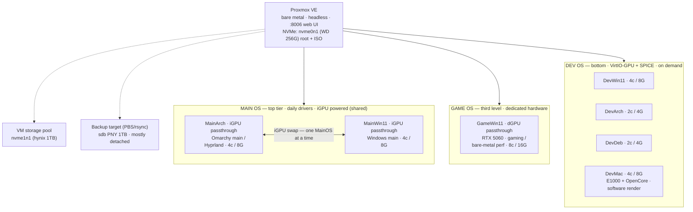

# ProxDev — Proxmox multiverse plan (PHN16S-71 laptop)

Date: 2026-09-17 · Modified: 2026-09-17
Status: **decided — building PVE on nvme0n1 (bare metal)**

Naming convention: `<Tier><OS>` — Main* (top), Game* (third level), Dev* (bottom).

Other docs: [HARDWARE.md](HARDWARE.md) · [NETWORKING.md](NETWORKING.md) ·
[ProxLab.md](ProxLab.md).

## Identity
| | |
|---|---|
| Name | **ProxDev** (host) |
| Role | Portable PVE server / VM multiverse |
| Hostname | `proxdev` |

## Network
| | |
|---|---|
| Home LAN (MGMT) | **10.10.20.1** on **10.10.20.0/24** · `https://10.10.20.1:8006` |
| Internal VM bridge | vmbr0 **10.20.0.0/24** · gw 10.20.0.1 |
| Uplink | Wi-Fi `wlp128s20f3` · Killer `enp130s0` · USB-C hub `enp0s13f0u1u4u4` |
| NAT | host NAT/masquerade; VMs keep talking when uplink changes |

## Architecture



## Hard rules

- PCI passthrough is exclusive: 1 physical GPU = 1 running VM.
- Max 2 VMs with a real GPU at a time (only 2 GPUs available).
- The iGPU is shared exclusively between MainArch and MainWin11 — the swap
  is safe because exactly one MainOS runs at a time (start one → stop the
  other). The dGPU (NVIDIA RTX 5060) is reserved for GameWin11.
- No GPU attached to the host — Proxmox is headless by design.
- Availability rule: at least ONE MainOS VM (MainArch or MainWin11) is
  always booted — never an empty hypervisor.
- VirtIO-GPU gives OpenGL 3D accel — fine for IDEs/terminals/browsers.
- macOS: no Nvidia support (RTX 5060 → no GPU for DevMac ever); needs OpenCore;
  E1000 NIC (no virtio-net); Apple EULA = personal dev/testing only.
- Networking = NAT: all VMs sit behind vmbr0 (10.20.0.0/24) with NAT
  masquerade. Outbound works over host Wi-Fi *or* Ethernet (bridging Wi-Fi
  is impossible — Wi-Fi is a client; route+NAT instead). Inbound from LAN
  is isolated; expose ports / real bridge only when docked on Ethernet.
  Full runbook: **NETWORKING.md**. Subnet 10.20.0.0/24 deliberately avoids the
  home router (10.10.10.0/24) and ISP-modem trap (10.0.0.1).
- IPv4-only NAT (video semantics): VMs get IPv4; no IPv6 out of the box.

## Storage layout (decided 2026-09-17)

| Drive | Size | Role |
|---|---|---|
| **nvme0n1** — WD SN520, M.2 slot 2 | 256G | **Proxmox VE** root + system + ISO images |
| **nvme1n1** — SK hynix P41, M.2 slot 1 | 1TB | **VM storage pool** (VM disks) — LVM-thin or ZFS |
| **sdb** — PNY SATA 1TB, USB | 1TB | **Backup target** (PBS or rsync) — mostly detached |

Rules:
- PVE OS/ISO never share space with VM disks → keep VM disks on the hynix pool.
- sdb lives detached; attach only when the backup window runs.
- ISO images mirror to sdb for offline boot/rescue.
- No local data rescue needed: home/dotfiles are already backed up on GitHub.
  hynix can go straight to pool duty (it holds the old install; that content
  is intentionally discarded).

## Resource budget (real host: 24C/24T, 64GB)

| VM        | Cores | RAM  | GPU                     | Notes           |
|-----------|-------|------|-------------------------|-----------------|
| GameWin11 | 8     | 16G  | dGPU (VFIO)             | single dGPU slot|
| MainArch  | 4     | 8G   | iGPU (VFIO, shared)     | default boot    |
| MainWin11 | 4     | 8G   | iGPU (VFIO, shared)     | swap with Main  |
| DevWin11  | 4     | 8G   | VirtIO-GPU              | on demand       |
| DevArch   | 2     | 4G   | VirtIO-GPU              | on demand       |
| DevDeb    | 2     | 4G   | VirtIO-GPU              | on demand       |
| DevMac    | 4     | 8G   | software render         | on demand       |

- Sum: 28 cores / 56G → **cores overcommit ~17% above the 24 threads.**
  All-7-simultaneous is possible but hot (laptop); realistic profile:
  always 1×MainOS + GameWin11, Dev* spun up as needed.
- MainOS is always guaranteed RAM (fixed, no ballooning).

## Proxmox install essentials

- Host: **nvme0n1** (WD). Installer will use its existing EFI partition.
- Hostname: **proxdev** (`hostnamectl set-hostname proxdev`).
  Home-LAN address: **10.10.20.1** on 10.10.20.0/24 (static/DHCP-reserve in
  the router; router 10.10.10.1, ProxLab lives on 10.10.30.1/10.10.30.0/24);
  internal vmbr0 keeps 10.20.0.1/24.
- BIOS: IOMMU (VT-d) already active; confirm `iommu=pt` on the PVE kernel.
- VFIO-isolate at boot: iGPU `8086:7d67`, dGPU `10de:2d59` + `10de:22eb`
  (RTX 5060 GPU + HDA audio — same IOMMU group 14).
- Windows VMs: `machine: q35`, OVMF, `cpu: host,hidden=1,aes=1`.
- Storage: create the 1TB pool on nvme1n1 as **LVM-thin** (cheap snapshots)
  or **ZFS** (but ZFS on a laptop spins RAM + batteries — LVM-thin preferred).
- MainArch VM: fixed RAM (no ballooning), snapshot before risky changes.
- Boot policy: MainOS tier start-on-boot priority. Default boot target:
  **MainArch** — fresh manual Omarchy install inside a VM (not a converted
  image). MainWin11 started manually after stopping MainArch (iGPU swap).
  **GameWin11 start-on-boot OFF** — manual start only (dGPU VFIO wants a
  deliberate boot order; never race the iGPU's owner at host power-on).
- Secure Boot: enroll PVE keys or disable SB for the PVE boot.

## Build runbook (tested on ThinkPad P1 Gen2, PVE 7.1-2 ISO)

> Applies as-is to PHN16S-71 with one addition: use the **newest available
> PVE (8.x or later) + its latest pve-kernel**. Arrow Lake (Core Ultra 200)
> needs kernel 6.6+ to boot/run hybrid-P/E correct; if the stock kernel
> misbehaves, install the newest `pve-kernel`/edge kernel from the Proxmox
> repos. The old PVE 7 (5.15 kernel) will NOT boot this CPU.

1. **Plug the ethernet cable** — internet is required during install (iwd
   is not installed by default). PHN16S: Killer E3000 2.5GbE.
2. **Install Proxmox** on nvme0n1 (WD). Select the WD disk as target.
3. Reboot, login as `root`.
4. **Fix repos**: comment `pve-enterprise` in
   `/etc/apt/sources.list.d/pve-enterprise.list`; add
   `/etc/apt/sources.list.d/pve-no-subscription.list`:
   `deb http://download.proxmox.com/debian/pve bullseye pve-no-subscription`
   (bullseye = PVE 7; use the `bookworm` line that matches your PVE release).
5. `apt update && apt dist-upgrade`
6. **Desktop/WM on the host is optional** — Proxmox is headless by design in
   this plan; skip step, log in via `https://<ip>:8006`.
7. **Bridge + NAT (internet for VMs even on Wi-Fi)** — full walkthrough in
   **NETWORKING.md** (real ifaces: `wlp128s20f3`, `enp130s0`,
   `enp0s13f0u1u4u4`). `/etc/network/interfaces`:
   ```
   auto vmbr0
   iface vmbr0 inet static
        address 10.20.0.1/24
        bridge-ports none
        bridge-stp off
        bridge-fd 0
   ```
   (10.20.0.0/24 avoids home router 10.10.10.0/24 and ISP-modem 10.0.0.1.)
8. **nftables masquerade**:
   - `echo net.ipv4.ip_forward=1 > /etc/sysctl.d/routing.conf && sysctl -p --system`
   - `systemctl enable nftables.service`
   - `/etc/nftables.conf`:
     ```
     flush ruleset
     table ip nat {
             chain postrouting {
                     type nat hook postrouting priority 0; policy accept; masquerade
             }
     }
     ```
   - `systemctl start nftables.service`
9. **Host Wi-Fi — two proven paths** (the host drives VMs' internet via NAT;
   regardless of path, vmbr0 must stay `bridge-ports none`):

   **Path A (video): wpa_supplicant + iptables-persistent**
   - `apt install -y iw wireless-tools wpa_supplicant iptables-persistent`
   - `/etc/network/interfaces` (wlan = `wlp…`, use `ip a` to find it):
     ```
     auto wlpXXX
     iface wlpXXX inet dhcp
         wpa-ssid "YOURSSID"
         wpa-psk "YOURPASSWORD"
     ```
   - Routing rules as in step 8 but iptables-style, saved by
     `netfilter-persistent save` + `systemctl enable netfilter-persistent`.
   - iwlwifi + wpa_supplicant is the Debian-native combo; if the ifupdown
     wpa block is flaky (known on bookworm), fall back to Path B.

   **Path B (tested on P1G2): iwd + nftables**
   - `apt install -y iwd`; `systemctl enable --now iwd`
   - `/etc/iwd/main.conf`:
     ```
     [General]
     EnableNetworkConfiguration=true
     ```
   - `iwctl station wlan0 connect <SSID>` (interactive scan/connect)
   - masquerade via `/etc/nftables.conf` as in step 8.

10. Create user, reboot, unplug ethernet, connect to Wi-Fi.
11. **VM/CT network convention:** each VM gets `10.20.0.x/24`, gw `10.20.0.1`.
    NAT gives VMs outbound internet over the host's Wi-Fi or Ethernet.
    MainArch is the management VM (reach PVE at `10.20.0.1:8006`).

## VM IP plan (NAT)

| VM | IP |
|---|---|
| ProxDev (PVE host, home LAN) | 10.10.20.1 — mgmt `https://10.10.20.1:8006` |
| vmbr0 / PVE host (internal gw) | 10.20.0.1/24 — mgmt `https://10.20.0.1:8006` |
| MainArch (MainVM) | 10.20.0.10 |
| MainWin11 | 10.20.0.11 |
| GameWin11 | 10.20.0.12 |
| DevWin11 | 10.20.0.20 |
| DevArch | 10.20.0.21 |
| DevDeb | 10.20.0.22 |
| DevMac | 10.20.0.23 |
| VM gateway / DNS | 10.20.0.1 / 1.1.1.1, 8.8.8.8 |

## Firewall / VLAN (future, per-server)

- Own firewall rules and its own VLAN setup — **not shared** with ProxLab.
- Cross-network to ProxLab (10.10.30.x / 10.30.0.0/24) **allowed only via
  explicit rules** permitting specific inter-server traffic.
- Router 10.10.10.1 routes between 10.10.10.0/24 ↔ 10.10.20.0/24.

## Roaming / leaving home (set up once, works everywhere)

> Full procedures: **NETWORKING.md** (§7 multi-SSID, §11 join-new-Wi-Fi, §14 VPN).

- VMs are **unaffected** by the host's uplink — vmbr0/NAT is host-internal;
  only the host's source IP + DNS upstream change.
- Wired roaming fighting? No — host connectivity only:
  1. **Phone-hotspot SSID block** in wpa_supplicant (2nd network, highest
     priority) → boot auto-joins hotspot at any coffeeshop/hotel.
  2. **USB tethering fallback**: `allow-hotplug usb0` + `iface usb0 inet dhcp`
     in `/etc/network/interfaces`. Plug in → instant uplink.
  3. **Tailscale on the host (install while wired)**: reach `10.20.0.1:8006`
     + VMs at a stable tailnet IP from anywhere; survives network renumbering.
  4. **Fixed upstream DNS** for VMs (1.1.1.1/8.8.8.8) — hotel/captive junk
     DNS never poisons VM resolution.
- Captive portals still need a browser/login — use tethering or `curl`-login
  on those. Open/manual networks fine with iwd.
- Travel default: at least MainArch always booted (availability rule intact);
  GameWin11/Dev* stay powered off on battery unless needed.

## Open questions → to verify while building

1. Do all 7 VMs run simultaneously, or spin-up-on-demand?
   - If not simultaneous: nothing changes re GPU (Gamer keeps dGPU); only
     thermals/RAM affect how many Dev* are up at once.
2. MainWin11 on iGPU passthrough: Windows takes the whole iGPU (no GVT-g
   split — deprecated). Confirm clean driver reset between VM hot swaps.
3. WD SN520 is a budget x2-lane drive: fine as PVE root; VM disk IO must
   stay on the hynix pool (never on the WD).
4. Backup flow: PBS (Proxmox Backup Server) scope — install as a PVE
   (`pbs` package) or a Linux container? Target = sdb, detached schedule.