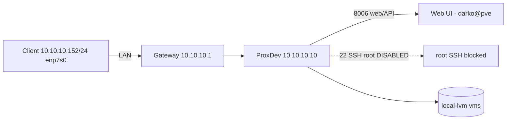

# Proxmox Server Notes

## ProxDev (10.10.10.10)

- **Proxmox VE**: 9.2.20 (release 9.2)
- **Web UI**: https://10.10.10.10:8006/
- **Node**: ProxDev - status: online (PVE node id `prodev`)
- **Hardware**: see [proxdev-hardware.md](./proxdev-hardware.md)

### Resources (2026-09-17 20:44)

| Resource | Value |
|----------|-------|
| CPU | 24 cores - load ~0% |
| RAM | 2.4 GB used / 62.2 GB total |
| VMs | 0 QEMU, 0 LXC containers |

#### Storage pools

| Pool | Type | Total GB | Used GB |
|------|------|----------|---------|
| local | dir | 67.7 | 5.8 |
| local-lvm | lvmthin | 141.2 | 0 |

## Access - 2026-09-17 root harden

> Credentials stored in Bitwarden - vault item: `ProxDev - Proxmox VE` (id `2cc66d2e-18e9-4aec-8c8c-b4c801087393`). Usernames/tokens below are redacted; get real values from Bitwarden (`bw get item 2cc66d2e-...`).

| User | Realm | Role | Status |
|------|-------|------|--------|
| darko@pve | pve | Administrator (ACL / propagate) | enabled |
| root@pam | pam | Administrator | DISABLED |

### Primary admin: darko@pve

- **Userid**: darko@pve
- **Role**: Administrator (ACL on `/`, propagate) - full web + API access
- **Password**: Bitwarden (`ProxDev - Proxmox VE`)
- **API token**: Bitwarden (`darko@pve!clitoken` - token_secret field)

### root@pam - DISABLED

- **Enable**: 0
- API/GUI login now returns 401
- Old root token `root@pam!clitoken=0047ca46-...` is dead (401) - revoked
- [OK] root SSH login disabled 2026-09-17 (sshd_config `PermitRootLogin no`, reloaded, verified rejected). Backup: `/etc/ssh/sshd_config.bak.20260917`.

## API usage

```bash
# Get token from Bitwarden, then:
curl -sk -H "Authorization: PVEAPIToken=<darko@pve!clitoken>=<secret>" \
  https://10.10.10.10:8006/api2/json/version

# Ticket login:
curl -sk -X POST https://10.10.10.10:8006/api2/json/access/ticket \
  -d "username=darko@pve&password=<from-bitwarden>"
```

## Network

- Server: 10.10.10.10/24, gateway 10.10.10.1
- Client machine: 10.10.10.152/24 on enp7s0

### Topology



## TODO

- [x] Store darko@pve password + token in Bitwarden (item: `ProxDev - Proxmox VE`)
- [x] Disable root SSH login on host (PermitRootLogin no)
- [ ] Verify web UI "Shell" works as darko@pve
- [ ] Decide GPU passthrough / VM plan (RTX 5060 idle)