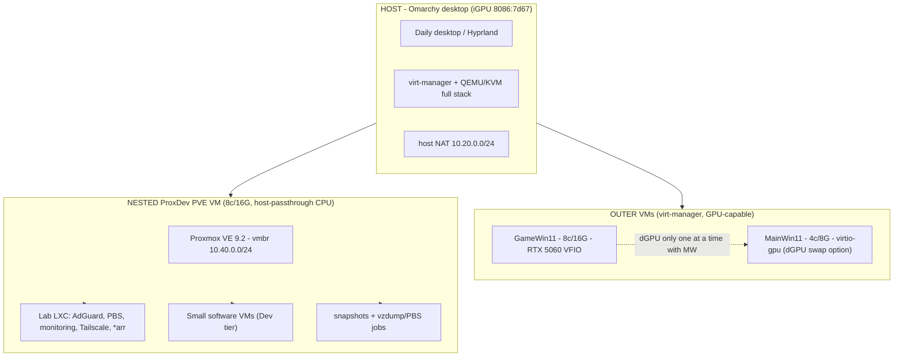

# OmaLaptop - Omarchy desktop + nested Proxmox plan (PHN16S-71 laptop)

Status: **PIVOTED (2026-09-18)** - no more bare-metal PVE. OmaLaptop is now an
**Omarchy desktop host (iGPU)** running virt-manager/QEMU; inside a nested
**ProxDev PVE VM** hosts the headless lab tier. This file is the
authoritative blueprint.

Other docs: [hardware.md](hardware.md) - [networking.md](networking.md) -
[proxlab.md](proxlab.md). Research: 34 (nested PVE), 35 (outer host stack),
36 (nested PVE ops), 37 (Arrow Lake iGPU), 38 (Blackwell VFIO),
39 (nested vs flat), 40 (Omarchy / agent / mise).

## Identity

| | |
|---|---|
| Name | **OmaLaptop** (host) |
| Role | Daily desktop (Omarchy) + KVM host + nested PVE lab instance |
| Hostname | `omalaptop` (Omarchy box = Acer Predator PHN16S-71) |
| Host OS | Omarchy / Arch, Hyprland, iGPU (8086:7d67) |

## Network (reality, 2026-09-17 + pivot)

| | |
|---|---|
| Home LAN (MGMT) | **10.10.10.10** on **10.10.10.0/24** - mgmt :8006 moved to 10.20.0.1 path |
| Host VM bridge | **10.20.0.0/24** - gw 10.20.0.1 (host NAT) |
| Nested PVE bridge | **10.40.0.0/24** - gw 10.40.0.1 (lab, behind PVE guest) |
| Router | 10.10.10.1 |
| Uplink | Wi-Fi / USB-C hub LAN / Killer E3000 (host owns it) |

## Architecture (locked 2026-09-18)

Layers:
1. **Host tier** - Omarchy on iGPU. Everything else is nested/VM.
2. **Outer GPU tier** - GameWin11 (RTX 5060 10de:2d59 + 10de:22eb,
   group 14, VFIO via virt-manager). MainWin11 = virtio-gpu; dGPU may be
   reassigned between the two (never simultaneously).
3. **Nested PVE tier** - lab LXC, software VMs, snapshots/backups. No GPU
   inside PVE (hard rule: nested PVE cannot re-pass-through devices).

## Hard rules

- **GPU passthrough only at the OUTER level.** The nested PVE VM can never
  hand a PCI device to its own guests. No GPU workloads inside nested PVE.
- iGPU is host-only (desktop). It is never passed to a VM (research/37).
- Blackwell dGPU (research/38): NO `iommu=pt`, add `vfio-pci.disable_idle_d3=1`
  + udev D0 rule, and cap at ONE GPU VM start per host boot (reset broken).
- **Tiering escape hatch (research/36):** IO-heavy software VMs may run at the
  OUTER level (10.20.0.x, virt-manager) instead of inside nested PVE; keep
  only LXC + light VMs nested. GPU rule unchanged.
- **Home mgmt IP = 10.10.10.10 on the Omarchy laptop** (reuses the old PVE
  address). DHCP-reserve it on the router (host is DHCP on Wi-Fi); host DNAT
  forwards `10.10.10.10:8006 -> 10.20.0.30:8006` to the nested PVE so the old
  mgmt URL keeps working.
- The nested PVE VM needs `nested=1` (kvm_intel) + CPU host-passthrough.
- One dGPU consumer at a time (GameWin11 <-> MainWin11 swap only).
- Host owns Wi-Fi + NAT (see networking.md) - never bridge the wlan.
- Nested PVE is a **standalone lab instance** - no cluster/HA with ProxLab.
- hynix 1TB = host KVM pool (thin qcow2). No virtual disk on the WD SN520.

## Resource budget (real host: 24C/24T, 62 GB usable)

| Piece | Cores | RAM | GPU | Notes |
|---|---|---|---|---|
| Omarchy host desktop | rest | rest | iGPU | fixed |
| GameWin11 (outer) | 8 | 16G | RTX 5060 (VFIO) | manual start |
| MainWin11 (outer) | 4 | 8G | virtio-gpu (or swap dGPU) | on demand |
| Nested ProxDev PVE | 8 | 16G | none | growable on demand |
| Inside PVE: Lab LXC + Dev VMs | from PVE 8c | from PVE 16G | - | software only |

- ~20 cores / 40G committed worst-case; realistic profile = desktop + one
  dGPU VM + nested PVE, Dev VMs spun up as needed.
- Nested PVE RAM fixed 16G (no ballooning to keep nested guest stable).

## Host install essentials (Omarchy)

- Omarchy on **nvme0n1** (WD SN520, 256G). Omarchy mandates LUKS + btrfs
  (+compression) + Limine bootloader (research/35); kernel cmdline lives in
  boot/limine.conf. iGPU drives the desktop.
- Install virt stack:
  `sudo pacman -S qemu-desktop libvirt virt-manager dnsmasq edk2-ovmf swtpm
  iptables-nft tpm2-tools`
- Enable: `systemctl enable --now libvirtd virtlogd`
- IOMMU: kernel cmdline `intel_iommu=on` ONLY - NO `iommu=pt` (Blackwell
  rejects a 1:1-promise under passthrough IOMMU; research/38). Verify VT-d
  in dmesg. VFIO-isolate dGPU group 14 (`10de:2d59`, `10de:22eb`) at boot
  via `vfio-pci.ids=` + softdep; add `vfio-pci.disable_idle_d3=1` + udev D0
  rule; dGPU added to the GameWin11 domain only.
- Nested: `echo 'options kvm_intel nested=1' > /etc/modprobe.d/kvm_intel.conf`
  + module reload (research/34).

## Host storage layout (decided 2026-09-17, PVE pivot 2026-09-18)

| Drive | Size | Role |
|---|---|---|
| **nvme0n1** - WD SN520, M.2 slot 2 | 256G | **Omarchy OS** + ISOs |
| **nvme1n1** - SK hynix P41, M.2 slot 1 | 1TB | **KVM pool** - thin qcow2 (`/var/lib/libvirt/images` or per-vm dir) |
| **sdb** - PNY SATA 1TB, USB | 1TB | **Backup target** (PBS/rsync) - mostly detached |

- qcow2 thin images: nested PVE disk (~80G initially) + outer VM disks.
- hynix @ 99% wear (research/30): keep reflink/trim-friendly, avoid swap.

## VM/IP plan (double-NAT)

| Layer | Device | IP |
|---|---|---|
| Home (LAN) | Host home addr (DHCP-reserved) | 10.10.10.10/24 |
| Host bridge | gw / mgmt :8006 path | 10.20.0.1/24 |
| Nested PVE guest (outer net) | :8006 via host DNAT 10.10.10.10:8006 | 10.20.0.30/24 |
| GameWin11 / MainWin11 (outer) | | 10.20.0.11 / 10.20.0.12 |
| PVE internal bridge | lab gw | 10.40.0.1/24 |
| Lab LXC / Dev VMs | AdGuard 10.40.0.2, PBS 10.40.0.3, Dev* .10-.20 | 10.40.0.x |
| VM gateway / DNS | 10.20.0.1 / 1.1.1.1, 8.8.8.8 (lab: 10.20.0.1) | |

## Build runbook (order matters)

Phase A - host
1. Install Omarchy on nvme0n1 (iGPU display already works).
2. Virt stack + systemd enable. IOMMU `intel_iommu=on` (NO `iommu=pt` -
   Blackwell) + VFIO ids + disable_idle_d3 + udev D0 rule; verify groups.
3. ISOs to nvme0n1; create hynix pool dirs; baseline tooling + git repo
   clone (this repo is the runbook).
4. Host NAT bridge (10.20.0.0/24) - networking.md runbook; test with a
   throwaway VM. Multi-SSID wpa_supplicant + firmware + power_save + watchdog
   (networking.md sec 18).
4b. DHCP-reserve **10.10.10.10** for the host on router 10.10.10.1 (host is
    DHCP on Wi-Fi); add host DNAT `10.10.10.10:8006 -> 10.20.0.30:8006` so the
    old PVE mgmt URL keeps working from the LAN.

Phase B - nested ProxDev PVE
5. Create nested guest: q35 + OVMF + host-passthrough + 8c/16G + 80G qcow2
   on hynix, virtio NIC 10.20.0.30. Boot PVE 9.2 ISO.
6. PVE baseline: repos (no-subscription still optional; nested = lab), apt,
   darko@pve + TFA, no-enterprise.
7. PVE-internal vmbr 10.40.0.0/24 + NAT -> 10.20.0.1. Confirm lab egress.
8. First lab LXC: AdGuard (10.40.0.2), then PBS (10.40.0.3) + first backup
   job + restore drill (research/05/32).

Phase C - outer GPU VMs
9. GameWin11: q35/OVMF/vTPM, RTX 5060 + audio group 14 VFIO, Windows 11
   install, NVIDIA driver + reset quirk if needed (research/29).
10. MainWin11: same minus VFIO (virtio-gpu); document dGPU swap.
11. Session test: VMs survive host suspend/resume; nested PVE reboot after
    resume; GameWin11 daily driver checks (latency, OBS output).

Phase D - reliability (nested + outer)
12. Backups: nested PBS (or host rsync) covers PVE, LXC, outer VMs; PNY
    monthly copies (research/28); wearout monitor (research/30).
13. Monitoring LXC inside PVE (research/22) + host smartctl (research/30).
14. Security: TFA darko@pve, libvirt network ACLs, Tailscale on host
    (research/16). Power tuning (research/15).

Phase E - ProxLab (separate, stand-alone)
15. X99 -> ProxLab PVE (research/31), RX 5700 XT vendor-reset (research/25),
    storage (research/26), standalone backups (research/28). No cluster.

## Open questions - verify while building

1. Outer dGPU swap GameWin11<->MainWin11: reuse the reset hookscript pattern
   (research/02, 29, 25) at libvirt level.
2. Nested PVE reboot after host S3 resume: expected; confirm recipe + script.
3. hynix 1TB thin pool layout: single dir + qcow2 (thin) vs partition pool;
   decide at Phase B build from research/30 wear math.