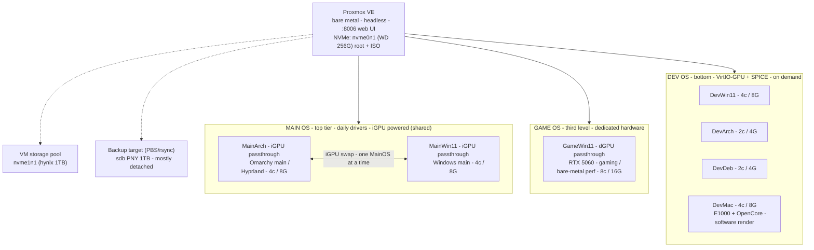

# ProxDev - Proxmox multiverse plan (PHN16S-71 laptop)

Status: **IN USE** - this laptop is now the ProxDev server at 10.10.10.10:8006
(PVE 9.2.20, node `prodev`). The plan below is the living blueprint; where it
differs from reality (e.g. management IP changed to 10.10.10.10), reality wins
and the plan is updated.

Other docs: [hardware.md](hardware.md) - [networking.md](networking.md) -
[proxlab.md](proxlab.md).

## Identity

| | |
|---|---|
| Name | **ProxDev** (host) |
| Role | Proxmox server / VM multiverse |
| Hostname | `prodev` (PVE node), host box = Acer Predator PHN16S-71 |

## Network (reality, 2026-09-17)

| | |
|---|---|
| Home LAN (MGMT) | **10.10.10.10** on **10.10.10.0/24** - `https://10.10.10.10:8006` |
| Internal VM bridge | vmbr0 **10.20.0.0/24** - gw 10.20.0.1 |
| Router | 10.10.10.1 |
| Uplink | Killer E3000 2.5GbE (r8169) / USB-C hub LAN / Wi-Fi |

## Architecture



## Hard rules

- PCI passthrough is exclusive: 1 physical GPU = 1 running VM.
- Max 2 VMs with a real GPU at a time (only 2 GPUs available).
- The iGPU is shared exclusively between MainArch and MainWin11 - the swap is
  safe because exactly one MainOS runs at a time (start one - stop the other).
  The dGPU (NVIDIA RTX 5060) is reserved for GameWin11.
- No GPU attached to the host - Proxmox is headless by design.
- Availability rule: at least ONE MainOS VM (MainArch or MainWin11) is always
  booted - never an empty hypervisor.
- VirtIO-GPU gives OpenGL 3D accel - fine for IDEs/terminals/browsers.
- macOS: no Nvidia support (RTX 5060 - no GPU for DevMac ever); needs OpenCore;
  E1000 NIC (no virtio-net); Apple EULA = personal dev/testing only.
- Networking = NAT: all VMs sit behind vmbr0 (10.20.0.0/24) with NAT
  masquerade. Outbound works over host Wi-Fi or Ethernet (bridging Wi-Fi is
  impossible - Wi-Fi is a client; route + NAT instead). Inbound from LAN is
  isolated; expose ports / real bridge only when docked. Full runbook:
  networking.md. Subnet 10.20.0.0/24 deliberately avoids the home router
  (10.10.10.0/24). IPv4-only NAT.

## Storage layout (decided 2026-09-17)

| Drive | Size | Role |
|---|---|---|
| **nvme0n1** - WD SN520, M.2 slot 2 | 256G | **Proxmox VE** root + system + ISO images |
| **nvme1n1** - SK hynix P41, M.2 slot 1 | 1TB | **VM storage pool** (VM disks) - LVM-thin or ZFS |
| **sdb** - PNY SATA 1TB, USB | 1TB | **Backup target** (PBS or rsync) - mostly detached |

Rules:
- PVE OS/ISO never share space with VM disks - keep VM disks on the hynix pool.
- sdb lives detached; attach only when the backup window runs.
- ISO images mirror to sdb for offline boot/rescue.
- No local data rescue needed: home/dotfiles are already backed up on GitHub;
  hynix can go straight to pool duty (old install content is discarded).

## Resource budget (real host: 24C/24T, 62 GB usable)

| VM | Cores | RAM | GPU | Notes |
|---|---|---|---|---|
| GameWin11 | 8 | 16G | dGPU (VFIO) | single dGPU slot |
| MainArch | 4 | 8G | iGPU (VFIO, shared) | default boot |
| MainWin11 | 4 | 8G | iGPU (VFIO, shared) | swap with MainArch |
| DevWin11 | 4 | 8G | VirtIO-GPU | on demand |
| DevArch | 2 | 4G | VirtIO-GPU | on demand |
| DevDeb | 2 | 4G | VirtIO-GPU | on demand |
| DevMac | 4 | 8G | software render | on demand |

- Sum: 28 cores / 56G - cores overcommit ~17% above the 24 threads.
  All-7-simultaneous is possible but hot (laptop); realistic profile:
  always 1x MainOS + GameWin11, Dev* spun up as needed.
- MainOS is always guaranteed RAM (fixed, no ballooning).

## Proxmox install essentials

- Host: **nvme0n1** (WD). Installer uses its existing EFI partition.
- Home-LAN address: **10.10.10.10** on 10.10.10.0/24 (router 10.10.10.1);
  internal vmbr0 keeps 10.20.0.1/24.
- BIOS: IOMMU (VT-d) already active; confirm `iommu=pt` on the PVE kernel.
- VFIO-isolate at boot: iGPU `8086:7d67`, dGPU `10de:2d59` + `10de:22eb`
  (RTX 5060 GPU + HDA audio - same IOMMU group 14).
- Windows VMs: `machine: q35`, OVMF, `cpu: host,hidden=1,aes=1`.
- Storage: create the 1TB pool on nvme1n1 as **LVM-thin** (cheap snapshots)
  or **ZFS** (but ZFS on a laptop spins RAM + batteries - LVM-thin preferred).
- MainArch VM: fixed RAM (no ballooning), snapshot before risky changes.
- Boot policy: MainOS tier start-on-boot priority. Default boot target:
  MainArch - fresh manual Omarchy install inside a VM. MainWin11 started
  manually after stopping MainArch (iGPU swap). **GameWin11 start-on-boot
  OFF** - manual start only (dGPU VFIO wants a deliberate boot order).
- Secure Boot: enroll PVE keys or disable SB for the PVE boot.
- Done (2026-09-17): root SSH blocked, `darko@pve` admin instead of root@pam,
  TFA pending. See ../docs/proxdev-notes.md.

## Build runbook (tested on ThinkPad P1 Gen2, PVE 7.1-2 ISO)

> Uses the newest available PVE (9.x) + its latest pve-kernel. Arrow Lake
> (Core Ultra 200) needs kernel 6.6+ to boot/run hybrid P/E correct; stock
> PVE 7 (5.15 kernel) will NOT boot this CPU. PVE 9.2.20 is installed on this
> box (2026-09-17).

1. Plug the ethernet cable - internet is required during install.
2. Install Proxmox on nvme0n1 (WD). Select the WD disk as target.
3. Reboot, login as `root`.
4. Fix repos: comment `pve-enterprise`; add pve-no-subscription matching
   your PVE release (bookworm = PVE 8, trixie = PVE 9).
5. `apt update && apt dist-upgrade`
6. Proxmox is headless by design in this plan; log in via `https://<ip>:8006`.
7. Bridge + NAT (internet for VMs even on Wi-Fi) - full walkthrough in
   networking.md. `/etc/network/interfaces`:

   ```
   auto vmbr0
   iface vmbr0 inet static
        address 10.20.0.1/24
        bridge-ports none
        bridge-stp off
        bridge-fd 0
   ```

8. nftables masquerade:
   - `echo net.ipv4.ip_forward=1 > /etc/sysctl.d/routing.conf && sysctl -p --system`
   - `systemctl enable nftables.service`
   - /etc/nftables.conf:

     ```
     flush ruleset
     table ip nat {
             chain postrouting {
                     type nat hook postrouting priority 0; policy accept; masquerade
             }
     }
     ```

   - `systemctl start nftables.service`
9. Host uplink (vmbr0 stays `bridge-ports none`): wpa_supplicant + iptables-
   persistent (Debian-native) or iwd + nftables (P1G2-tested). See
   networking.md for full multi-SSID + NAT recipes.
10. Create user, reboot, unplug ethernet, connect to the uplink.
11. VM/CT convention: each VM gets 10.20.0.x/24, gw 10.20.0.1.

## VM IP plan (NAT)

| VM | IP |
|---|---|
| ProxDev (PVE host, home LAN) | 10.10.10.10 - mgmt https://10.10.10.10:8006 |
| vmbr0 / PVE host (internal gw) | 10.20.0.1/24 - mgmt https://10.20.0.1:8006 |
| MainArch (MainVM) | 10.20.0.10 |
| MainWin11 | 10.20.0.11 |
| GameWin11 | 10.20.0.12 |
| DevWin11 | 10.20.0.20 |
| DevArch | 10.20.0.21 |
| DevDeb | 10.20.0.22 |
| DevMac | 10.20.0.23 |
| VM gateway / DNS | 10.20.0.1 / 1.1.1.1, 8.8.8.8 |

## Firewall / VLAN (future, per-server)

- Own firewall rules and its own VLAN setup - not shared with ProxLab.
- Cross-network to ProxLab (10.10.30.x / 10.30.0.0/24) allowed only via
  explicit rules permitting specific inter-server traffic.
- Router 10.10.10.1 routes between 10.10.10.0/24 and 10.10.20.0/24 (future).

## Roaming / leaving home (set up once, works everywhere)

- VMs are unaffected by the host's uplink - vmbr0/NAT is host-internal; only
  the host's source IP + DNS upstream change.
- Phone-hotspot SSID block in wpa_supplicant (highest priority) - boot
  auto-joins hotspot at any coffeeshop/hotel.
- USB tethering fallback: `allow-hotplug usb0` + `iface usb0 inet dhcp`.
- Tailscale on the host (install while wired): reach 10.20.0.1:8006 + VMs at
  a stable tailnet IP from anywhere.
- Fixed upstream DNS for VMs (1.1.1.1/8.8.8.8).
- Captive portals still need a browser/login - use tethering or curl-login.
- Travel default: at least MainArch always booted; GameWin11/Dev* stay
  powered off on battery unless needed.

## Open questions - verify while building

1. Do all 7 VMs run simultaneously, or spin-up-on-demand?
   - If not simultaneous: nothing changes re GPU (GameWin11 keeps dGPU); only
     thermals/RAM affect how many Dev* are up at once.
2. MainWin11 on iGPU passthrough: confirm clean driver reset between VM hot
   swaps (no GVT-g split - deprecated).
3. WD SN520 is a budget x2-lane drive: fine as PVE root; VM disk IO must stay
   on the hynix pool (never on the WD).
4. Backup flow: PBS scope - install as a PVE (`pbs` package) or a Linux
   container? Target = sdb, detached schedule.